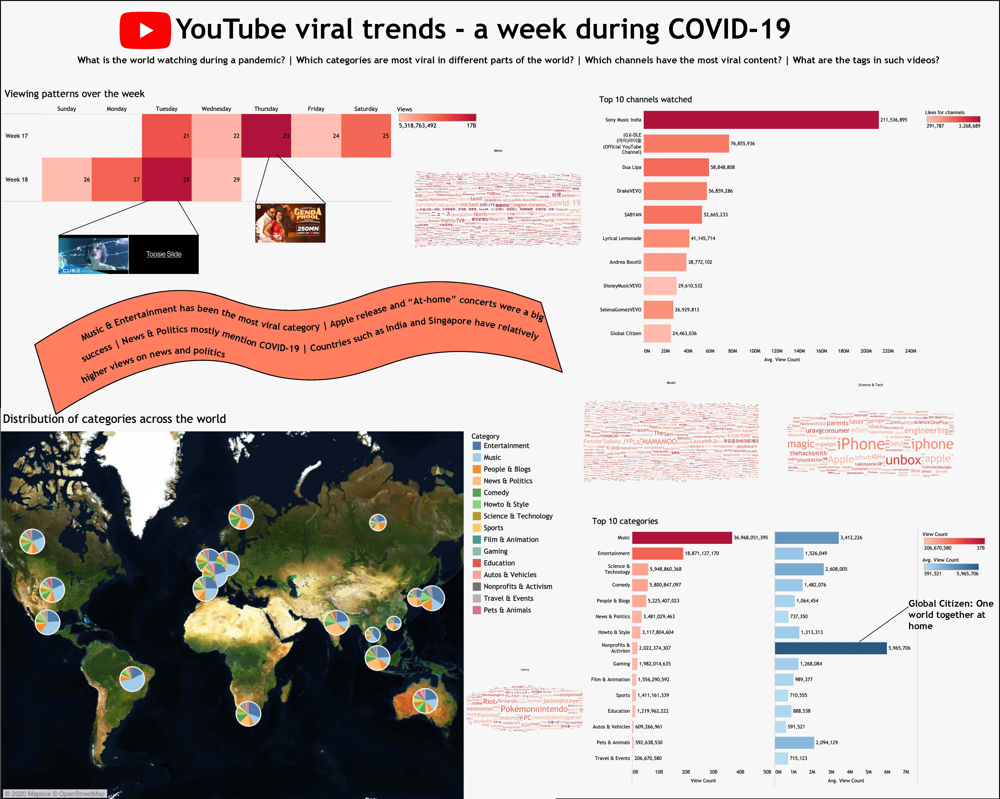

# YouTube-viral-trends-COVID

This repository contains the codes that generated the dataset for my Tableau Dashboard project.

### About the project
The aim of the project was to understand the viewing patterns on Youtube during a pandemic. This prompted me use the YouTube API to create a dataset that contained information from 18 different countries and across ~10 days in April 2020.

### Usefulness
You can check out the python script and some of my preprocessing codes to put the dataset together. The final dataset can be found in this repo, see YouTube.csv

### Dataset creation
The dataset was created by pulling the most popular ("Trending") videos for each country code I specify at the time of running the python script. So if I run the script at 3:00 pm ET to pull trending videos from USA, Australia and Singapore, then it'll provide the most popular videos at that given time. If I run this script again in another hour, the data I pull may change (although not by much).

So, given this situation I ran the script twice everyday, once midday around 12:00 pm ET and then again at 12:00 am ET. This helped in controlling for different time zones for trending videos.

The countries I chose to pull the data from were:
1. Australia
2. Brazil
3. Canada
4. France
5. Germany
6. Hong Kong
7. India
8. Japan
9. Mexico
10. Russia
11. Singapore
12. South Africa
13. South Korea
14. Spain
15. Sweden
16. Thailand
17. United Kingdom
18. United States

The final dataset created has about 50k rows

### Disclaimer
If you wish to replicate this, you'd need to create an API key for YouTube to request data. Since the data I scraped was the most popular videos in each of those 18 countries at any given point in time, there is no way to go back and pull trending videos in the past week, day, hour or even minute. The scraper works only for the present time, so be cautious while creating your own dataset.

The reason for restricting data to 10 days was the fact that it was taking a toll on Tableau to process more data and generate the visualization smoothly (especially while triggering the interactive elements)

### Results

The static visualization provides insights on YouTube videos that were trending in the last 10 days of April. It specifically emphasizes on views, likes, tags and channels. It helps understand what people watch during a randomly sampled window of 10 days during the peak of a pandemic. It also conveys the cultural differences in terms of the distrbution of video categories in different countries. An example of this would be: News & Politics related videos are watched a lot in India and Singapore but barely in Brazil or Mexico.

For the final interactive visualization, check out my [Tableau Public](https://public.tableau.com/profile/siddharth.suresh8869#!/vizhome/YouTube-Viral-Trends-COVID-19/YT) submission
